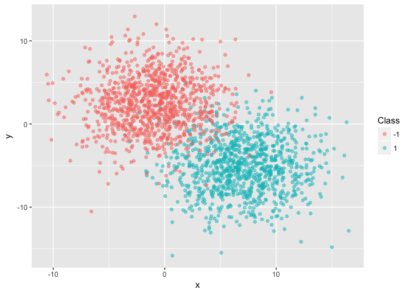
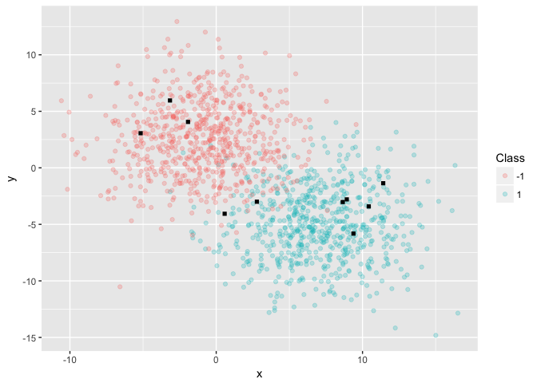
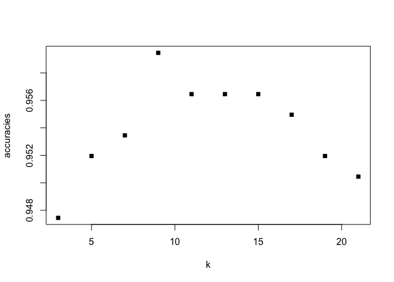

K-Nearest Neighbours
================

Generate Data
-------------

To keep this example as simple as possible, I will generate random data drawn from two different bivariate normal distributions and labelled as -1 or 1 depending on which distribution each datapoint was drawn from.

``` r
df1 = mvtnorm::rmvnorm(1000, mean = c(7, -5), sigma = matrix(c(11, 0, 0, 11), 2, 2))
df2 = mvtnorm::rmvnorm(1000, mean = c(-1, 2.5), sigma = matrix(c(11, 0, 0, 11), 2, 2))
df = as.data.frame(rbind(cbind(df1, 1L), cbind(df2, -1L)))
colnames(df) <- c("x", "y", "class")
```

In practice, when visualized in 2D, the data looks like two blobs centered at different x-y values:

``` r
library(ggplot2)

ggplot(df) +
  geom_point(aes(x = x, y = y, col = as.factor(class)), alpha = .5) +
  scale_color_discrete(name = "Class")
```



K-Nearest-Neighbours
--------------------

Our task here will be to classify new data as belonging to either the red or blue cluster. For this, we will use a very simple machine learning algorithm called *K-Nearest-Neigbours* (or **KNN**).

The idea is very simple: for each new point you wish to classify, simply list the K points closest to it and have them "vote" on what the predicted label for the new point should be. The idea here is that similar points are generally clustered among themselves and so that a new observation that lands in a neighbourhood that's heavily populated by blue points is very likely to be blue too.

Train-Test Split
----------------

Let's start by splitting the data into a training set `df_train` and a testing set `df_test`. This will allow us to check that our classifier indeed performs well on data it has not yet seen.

``` r
# Split Train / Test
# randomly hold out 1/3 of the data for testing
test <- sample(nrow(df), 666, replace = F) 
df_test <- df[test, ]
df_train <- df[-test, ]
```

In order to illustrate the task at hand, let us plot both the (labeled) tranning data along with a few occurence of the testing data which we wish to classify:

``` r
ggplot() +
  geom_point(aes(x = x, y = y, col = as.factor(class)), data = df_train, alpha = .25) +
  scale_color_discrete(name = "Class") +
  geom_point(aes(x = x, y = y), data = df_test[1:10,], col = "black", shape = 15)
```



The black squares are the data we wish to classify as either red (-1) or blue (1). You could probably do this yourself just by looking at where they landed, although this becomes more complicated as they approach the blurry "frontier" between the two clusters.

Implementing KNN in base R
--------------------------

In order to implement our own version of KNN, we need to decide on a notion of distance. A very often used distance between two points *u* = (*x*<sub>*u*</sub>, *y*<sub>*u*</sub>) and *v* = (*x*<sub>*v*</sub>, *y*<sub>*v*</sub>) is the *Euclidian Distance* which you probably know from high-school geometry and Pythagora's theorem:

$$eucl\\\_distance(u, v) =  \\sqrt{(x\_u - x\_v)^2 + (y\_u - y\_v)^2} $$

Although [other kinds of distances](link.com) can of course be used.

Euclidian distance can be implememted in R as follows:

``` r
# distance between any two vectors v1 and v2
euclid_dist <- function(v1, v2){
  return(sqrt(sum((v1 - v2)^2)))
}

a <- c(0, 0)
b <- c(1, 1)

euclid_dist(a, b)
```

    ## [1] 1.414214

We then need to define a function that will compute the distance between a new point and all other points in the training set. We could of course do this using a for-loop, but the base R functions from the [`apply` familly](coollink.com) will do this much more conveniently (and efficiently):

``` r
# distances between new data and the training (old) data
distance_each <- function(new_data, old_data){
  return(apply(old_data, MARGIN = 1, FUN = euclid_dist, v2 = new_data))
}
```

With this function in place, we are now ready to implement our classifier which: 1. takes in a new data point `new_vec` and the number of nearest neighbours to consider `k`, 1. computes the distance between `new_vec` and all other points in the training set, 1. orders the nearest points by (increasing) distance, 1. selects the `k` nearest points, and 1. returns its prediction for the label of `new_vec` (-1 or 1).

``` r
# classifier function
classify <- function(new_vec, k){
  neighb <- order(distance_each(new_vec, df_train[, c("x", "y")]),
                decreasing = F)[1:k]
  return(sign(sum(df_train[neighb, "class"])))
}
```

In order to preclude ties, `k` needs to be an odd number.

Let's now test our classifier on the testing data!

``` r
# predict
df_test$class_pred <- apply(df_test[, c("x", "y")], MARGIN = 1, FUN = classify, k = 3)

# evaluate
sum(df_test$class == df_test$class_pred) / length(df_test$class)
```

    ## [1] 0.9474474

Using K = 3, we get an accuracy of about 95%. That's not so bad! Let's now see if we can do better.

Tuning Hyperparameters: choosing `k`
------------------------------------

How does accuracy vary with our choice of `k`? We can determine this by testing our classifier on the test set using different k values:

``` r
accuracies = c()


for (i in seq(3, 21, 2)){
  df_test$class_pred <- apply(df_test[, c("x", "y")], MARGIN = 1, FUN = classify, k = i)
  acc <- sum(df_test$class == df_test$class_pred) / length(df_test$class)
  accuracies <- append(accuracies, acc)
}

plot(x = seq(3, 21, 2), y = accuracies, pch = 15, xlab = "k")
```



Clearly the "winning `k`" seems to be 9 with an accuracy of almost 96%, so that's the one we'll use for our classifier!

Finally, we can plot the misclassified data from the test set:

``` r
# use k = 9 to predict
df_test$class_pred <- apply(df_test[, c("x", "y")], MARGIN = 1, FUN = classify, k = 9)

# create a misclassified indicator
df_test$correct <- df_test$class == df_test$class_pred

#plot
ggplot(df_test) +
  geom_point(aes(x = x, y = y, col = as.factor(class_pred), shape = as.factor(correct), alpha = as.factor(!correct)),
             show.legend = T) +
  scale_color_discrete(name = 'Predicted Classes', guide = 'legend', labels = c('-1', "1")) +
  scale_shape_manual(name = 'Misclassified', guide = "legend", labels = c("Yes", "No"), values = c(4, 20)) +
  scale_alpha_discrete(range = c(.2, 1)) +
  guides(alpha = F) +
  ggtitle(label = "Misclassified Points - Testing Set", subtitle = "K-Nearest-Neighbours [K = 9]")
```


Clearly this isn't perfect -- but that's the best we can do using KNN (with the data that we have!)
